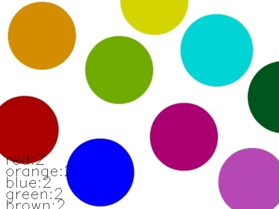

# color-detect


[](https://circleci.com/gh/MarvinKweyu/ColorDetect)


ColorDetect works to identify different color candies in an image.


### Installation

```bash
pip install ColorDetect
```

### Basic Usage
```python
from colordetect import ColorDetect


user_image = ColorDetect(<path_to_image>)
# get a dictionary return of color count
user_image.get_color_count()
# save the color count onto the image
user_image.save_color_count(<storage_path>,<image_name>)

```

Resultant image is stored in the string `storage_path` of choice with the `image_name` which will default to the current location and **out.jpg** respectively by default.


 *A sample output.*





### Contributions

Contributions are welcome.
Do remember to take a look at the project [contribution guidelines](./CONTRIBUTING.md)

#### Tests
To run tests:
```bash
pytest tests --image ./tests/test_files/image2.jpg
```

#### ToDo

- [ ]  Allow color count in videos.
