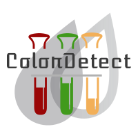

# ColorDetect

<p align="center">
  <b>ColorDetect</b><br>
  <a href="https://colordetect.readthedocs.io/en/latest/">Documentation</a> |
  <a href="https://pypi.org/project/ColorDetect/">Package</a> 
  <br><br>
  
</p>

[](https://pypi.org/project/ColorDetect/)
[](https://pypi.org/project/ColorDetect/)
[](https://circleci.com/gh/MarvinKweyu/ColorDetect)
[](https://pypi.org/project/ColorDetect/)
[](https://colordetect.readthedocs.io/en/master/)

ColorDetect works to recognize and identify different colors in an image or video.


### Installation

```bash
pip install ColorDetect
```

### Basic Usage

#### Images
```python
from colordetect import ColorDetect


user_image = ColorDetect(<path_to_image>)
# return dictionary of color count. Do anything with this
user_image.get_color_count()

# write color count
user_image.write_color_count()
# optionally, write any text to the image
user_image.write_text(text="any text")

# save the image after using either of the options (write_color_count/write_text) or both
user_image.save_image(<storage_path>,<image_name>)

```

Resultant image is stored in the string `storage_path` of choice with the `image_name` which will default to the current location and **out.jpg** respectively by default.

#### Videos

```python
from colordetect import VideoColor,col_share

user_video = VideoColor(<path_to_video>)
# return dictionary of color count. Do anything with this result
user_video.get_video_frames(progress=True)
# to order this rather long result and get only a specific number look up the `col_share` module
```


### Project Documentation

For further project documentation, visit [ColorDetect's page](https://colordetect.readthedocs.io/en/latest/) 

### Contributions

Contributions are welcome.
Do remember to take a look at the project [contribution guidelines](https://github.com/MarvinKweyu/ColorDetect/blob/master/CONTRIBUTING.rst)

#### Tests
To run tests:
```bash
pytest 
```

### Hall of Code

To the amazing human beings and developers that made this possible.
<div align="center">
<br>
<a href="https://github.com/MarvinKweyu/ColorDetect/graphs/contributors">
  
</a>
</div>
