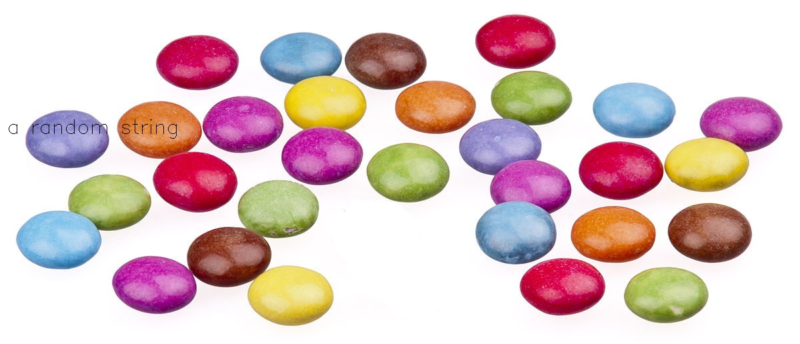

Welcome to ColorDetect's documentation
======================================

This site covers ColorDetect's usage and module documentation.

Getting started
===============

Installation
------------
.. code-block:: bash

    $ pip install ColorDetect

For usage , import as::

    import colordetect

Image color recognition
=======================

Example
--------

As a walk through some of the capabilities of ColorDetect we will use
this sample image.

.. image:: _static/doc_image.jpg

::

    # Get the most dominant color count from an image
    >>> from colordetect import ColorDetect
    >>>
    >>> my_image = ColorDetect("<image_path>")
    >>> my_image.get_color_count()
    '[2.0, 2.0, 249.0]': 6.2, '[5.0, 211.0, 212.0]': 7.15, '[173.0, 25.0, 98.0]': 17.49, '[146.0, 155.0, 9.0]': 18.62, '[253.0, 253.0, 253.0]': 50.54}

A dictionary, with the RGB value of the color as the key and its percentage occurrence in the image
as the value is returned.

.. note:: As of the ColorDetect 0.1.7, the percentage changed from being presented as a
          key to being presented as a value. This attributed to the uniqueness of python
          dictionary keys. See the :ref:`change log<0.1.7>` for more info.

For clarification::

    '[2.0, 2.0, 249.0]': 6.2
    # this key value pair would imply 6.2 % of the image, has an RGB of [2.0, 2.0, 249.0]

By default, `ColorDetect <https://colordetect.readthedocs.io/en/latest/>`_ will count
the 5 most dominant colors. This can , of course ,be overridden by parsing an argument specifying how many
colors most dominant you need from the image, with values decreasing in their percentage presence
the higher you go on the color count.

Look up :ref:`get_color_count<get_color_count>` for details
on the different arguments it accepts including the different color format return values.
Now suppose you want to take it a step further and write the result to the image itself.

.. warning:: Take note of the difference in saving the image to storage from the previous
             `save_color_count<save_color_count>` to `save_image<save_color_count>`

::

    >>> my_image.write_color_count()
    >>> my_image.save_image("<path_to_save_image>", "<name_of_image>")

Just as `save_color_count`,  :ref:`save_image<save_color_count>` will accept , as optional parameters, the path and name of the image with color count on it.
By default, these values are ``.`` (For the current directory the script is being run from)
and ``out.jpg`` respectively.

The result.

.. image:: _static/out_rgb.jpg

Depending on the size of the image, you might want to decide whether
to write the count to the image or not. As observed, a smaller image gives
a crowded appearance.

As a similar example, with colors represented in their hex format,

.. image:: _static/out_hex.jpg

Additionally, to enable the use of custom text on an image:

::

    >>> from colordetect import ColorDetect
    >>> my_image = ColorDetect("<image_path>")
    >>> my_image.write_text(text="a random string", line_spacing=10)

Here, `line_spacing` would be the space between the lines, depending on how many characters are
input, you want. By default, this value is an integer, zero, `0`, denoted as values on the Y axis scale

Whether using `write_text` or `write_color_count`, the image has to be saved using `save_image`.

Video color recognition can be done using :ref:`VideoColor<video_color_recognition>`

Interested to see just how far you can go? Take a look at :ref:`Contribution guidelines<Contributing>`.

`ColorDetect <https://github.com/MarvinKweyu/ColorDetect>`_  is always looking for the next step.

