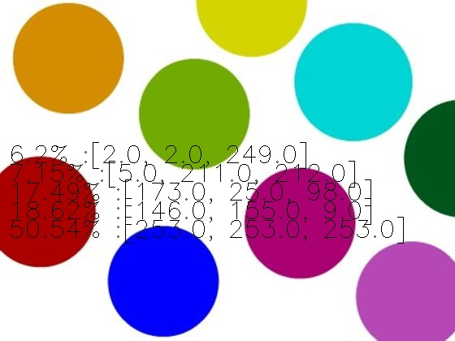

Welcome to ColorDetect's documentation
======================================

This site covers ColorDetect's usage and method documentation.

Getting started
===============

Installation
------------
.. code-block:: bash

    $ pip install ColorDetect

For usage , import as::

    import ColorDetect

Examples
--------

As a walk through some of the capabilities of ColorDetect we will use
this sample image.

::

    # Get the most dominant color count from an image
    >>> import ColorDetect
    >>>
    >>> my_image = ColorDetect("<image_path>")
    >>> my_image.get_color_count()
    {6.2: [2.0, 2.0, 249.0], 7.15: [5.0, 211.0, 212.0], 17.49: [173.0, 25.0, 98.0], 18.62: [146.0, 155.0, 9.0], 50.54: [253.0, 253.0, 253.0]}

A dictionary, with the RGB value of the color as the value and its percentage occurrence in the image
as the key is returned.

For clarification::

    6.2: [2.0, 2.0, 249.0]
    # this key value pair would imply 6.2 % of the image, has an RGB of [2.0, 2.0, 249.0]

By default, `ColorDetect <https://colordetect.readthedocs.io/en/latest/>`_ will count
the 5 most dominant colors. This can , of course ,be overridden by parsing an argument specifying how many
colors most dominant you need from the image, with values decreasing in their percentage presence
the higher you go on the color count.

Look up :ref:`get_color_count<get_color_count>` for details
on the different arguments it accepts including the different color format return values.
Now suppose you want to take it a step further and write the result to the image itself.

::

    my_image.save_color_count("<path_to_save_image>", "<name_of_image>")

The :ref:`save_color_count<save_color_count>` method will accept , as optional parameters, the path and name of the image with color count on it.
By default, these values are ``.`` (For the current directory the script is being run from)
and ``out.jpg`` respectively.

The result.

Depending on the size of the image, you might want to decide whether
to write the count to the image or not. As observed, a smaller image gives
a crowded appearance.

As a similar example, with colors represented in their hex format,

