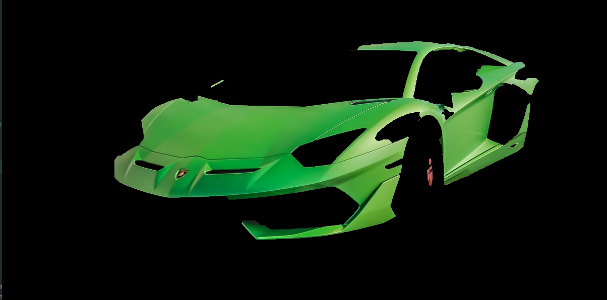
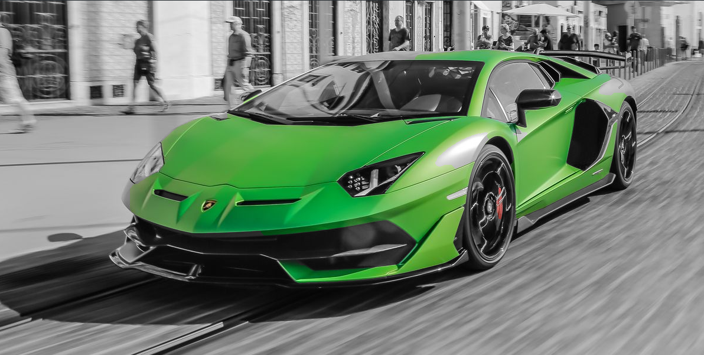

.. _color_segmentation:
Color segmentation
==================

Overview
--------

Color segmentation is the process by which specific target parts of the image are extracted based on , in this case
, their color.

Example
-------
Using the below image, extract the vehicle color. We will display both
a segmented image and a monochromatic image(which will exclude the vehicle from the monochrome color scale).

For this, we import `ColorDetect` as below:

::

    >>> import cv2
    >>> from colordetect import ColorDetect
    >>> my_car = ColorDetect('car.jpg')
    >>> monochromatic, gray, segmented, mask = my_car.get_segmented_image(lower_bound=(0, 70, 0), upper_bound=(80, 255, 255))
    >>> cv2.imshow('Segmented', segmented)
    >>> cv2.imshow('monochromatic', monochromatic)
    >>> cv2.wait(0)

The lower and upper bounds act as a range of colors from which to look from. as a result, our segmented image would appear as below:

``get_segmented_image()`` accepts more parameters such as `erode_iterations,dilate_iterations, use_grab_cut`, which is set True
by default and `gc_iterations` . You may increase or decrease these values depending on the clarity needed off the image.

Our monochromatic image:

